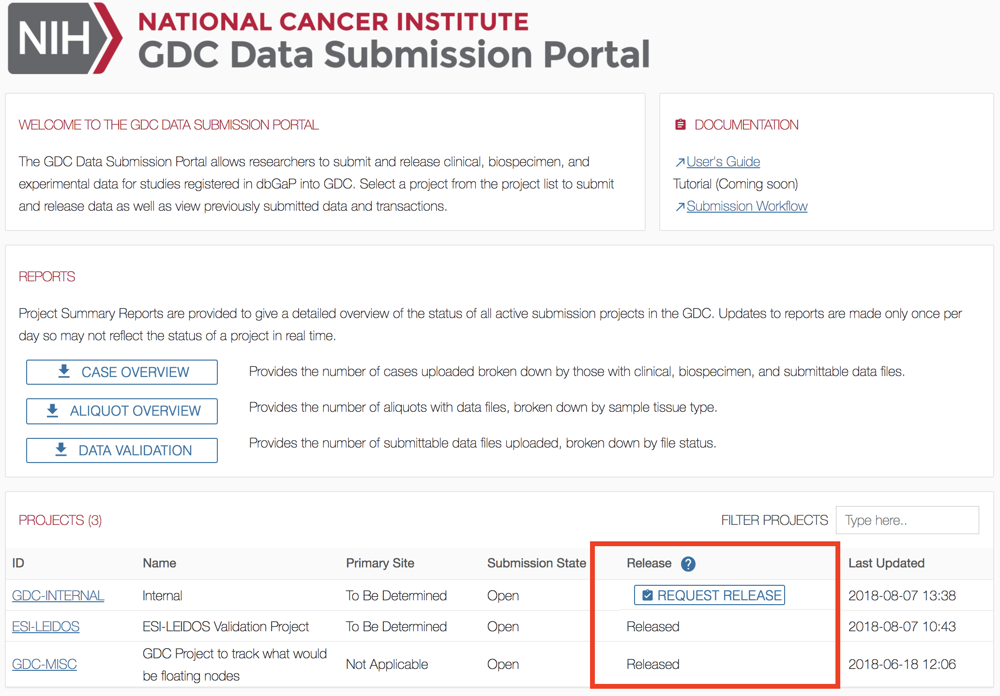

# Release
Project release occurs after the data has been harmonized and allows users to access this data with the GDC Data Portal. The GDC will release data according to [GDC Data Sharing Policies](https://gdc.cancer.gov/submit-data/data-submission-policies). Data may be released after six months from the date of upload, or the submitter may request earlier release using the "Request Release" function.  A project can only be released once. If additional data is added to the project after it is released, the data will be released automatically after harmonization.  

Upon release, harmonized data will be available to GDC users through the [GDC Data Portal](https://portal.gdc.cancer.gov/) and other [GDC Data Access Tools](https://gdc.cancer.gov/access-data/data-access-processes-and-tools).

**Note:** To release data to the GDC Data Portal, the user must have release privileges.

When the user clicks on the action _'Request Release'_, the following Release popup is displayed:

After the user clicks on "Release Submitted and Processed Data", the project release state becomes "Release Requested":

__Note__: Released cases and/or files can be redacted from the GDC. Redaction is performed by GDC administrators at the case level through synchronization with dbGaP and at the file level at the submitter's request usually after a data quality issue is identified. The GDC Data Submission Portal itself currently does not support redaction through the web interface.
