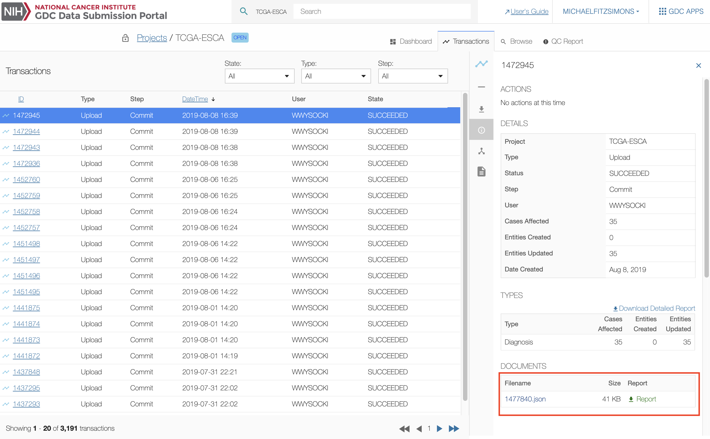

# Upload Data to Your Workspace

## Overview

The GDC Data Submission Portal allows users to upload and validate Clinical, Biospecimen and file metadata using the portal, register the Submittable Data Files, and submit the data files using the GDC Data Transfer Tool or API. The following diagram provides an overview of the process:

## Supported File Formats

### Metadata Files

The GDC API accepts project metadata in JSON and TSV formats for the purpose of creating entities in the GDC Data Model. This includes Clinical and Biospecimen metadata such as tumor classification, age at diagnosis, sample type, and details about the available data files. Upon successful data submission and project release, this metadata is stored in the GDC and becomes available to access through queries by data users with the GDC Data Portal and the GDC API. Before submitting metadata files:

* Review the [GDC Data Model](https://gdc.cancer.gov/developers/gdc-data-model) and the [GDC Data Dictionary](/Data_Dictionary/) to understand accepted metadata elements.
* Download metadata submission templates from the [GDC Data Dictionary](/Data_Dictionary/).

### Data Relationships

All submitted entities must be linked to existing entities in the [GDC Data Model](../../Data/Data_Model/GDC_Data_Model.md). In order to create the relationship, the user must include a reference to the related entity using its Submitter ID or Universally Unique Identifier (UUID).

For example, a Demographic entity describes a Case entity. The user is required to provide the case Submitter ID or UUID in the Demographic metadata.

For a new submission project, cases are the first entities to be created, and linked to the project. Other entities are then created according to the [GDC Data Model](../../Data/Data_Model/GDC_Data_Model.md).

### Download Previously Uploaded Metadata Files

The [transaction](Transactions.md) page lists all previous transactions in the project. The user can download metadata files uploaded to the GDC workspace in the details section of the screen by selecting one transaction and scrolling to the "DOCUMENTS" section.

### Download Previously Uploaded Files

The only supported method to download case data files previously uploaded to the GDC Submission Portal is to use the data transfer tool. For more information on downloading data using the data transfer tool please refer to [Downloading data using GDC file UUIDs](https://docs.gdc.cancer.gov/Data_Transfer_Tool/Users_Guide/Data_Download_and_Upload/#downloading-data-using-gdc-file-uuids) BFrom the browse tab link located on the project's home page navigate to the "Submittable Data Files" section and click on the submitter id associated with the file.  The UUID associated file will appear under the "SUMMARY" section in the file's information pain located on the right site of the page. [Submission Portal Summary View](images/gdc-submission-portal_image_summary_submission_UUID.png)  

For more information on downloading data using the data transfer tool with a UUID please refer to [Downloading data using GDC file UUIDs](https://docs.gdc.cancer.gov/Data_Transfer_Tool/Users_Guide/Data_Download_and_Upload/#downloading-data-using-gdc-file-uuids)

__Note:__ When submittable data files are uploaded through the Data Transfer Tool they are not displayed as transactions.

## Deleting Previously Uploaded Files

The GDC Data Submission Portal does not support the deletion of entities at this time. This can be performed using the API. See the [API Submission Documentation](../../API/Users_Guide/Submission/#deleting-entities) for specific instructions.
